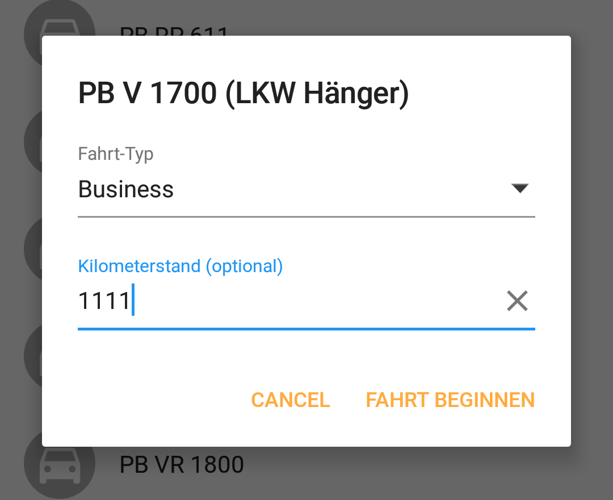

## Features

* Aligned text so you vertically align this in the same layout as a [MaterialEditText](https://github.com/rengwuxian/MaterialEditText) (as shown below in the screenshot)
  * Make sure that your `MaterialEditText` uses a text size of `16sp`
    * See https://material.io/guidelines/components/text-fields.html#text-fields-states
* Added `alwaysShowFloatingLabel`

## Screenshots

----

Here is how it looks like when it is aligned with a `MaterialEditText` embedded in a [dialog](https://github.com/afollestad/material-dialogs):

