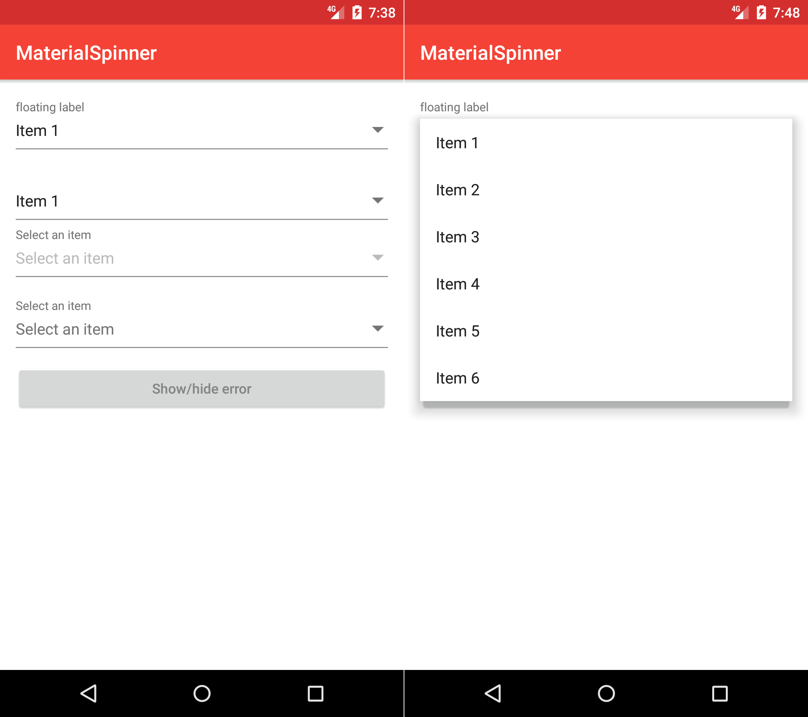

## Features

* Aligned text so you vertically align this in the same layout as a [MaterialEditText](https://github.com/rengwuxian/MaterialEditText) (not shown in the included demo though)
  * Make sure that your `MaterialEditText` uses a text size of `16sp`
    * See https://material.io/guidelines/components/text-fields.html#text-fields-states
* Added `alwaysShowFloatingLabel`

## Screenshots

